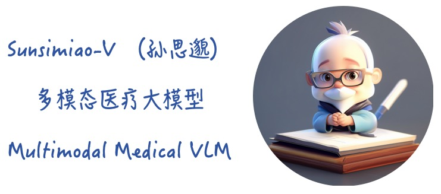
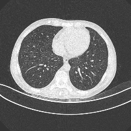

<!-- <h1 align="center">🌿Sunsimiao-V(孙思邈): 多模态医疗大模型</h1> -->
<div align=center></div>  

<h3 align="center">慧眼明医路，守护健康途</h3>

<p align="center">
<a href="https://github.com/thomas-yanxin/Sunsimiao-V"></a>
<a href="https://huggingface.co/collections/thomas-yanxin/sunsimiao-v-6641e52e2803b4fe0d88f451"></a>
<a href="https://www.modelscope.cn/models/thomas/Sunsimiao-V-Phi3/summary"></a>
<a href="https://wisemodel.cn/models/thomas/Sunsimiao-V-Phi3/intro"></a>
</p> 

<div align="center">

[](https://github.com/thomas-yanxin/Sunsimiao-V/blob/main/LICENSE)
[](https://github.com/thomas-yanxin/Sunsimiao-V/stargazers)
[](https://github.com/thomas-yanxin/Sunsimiao-V/fork)
[](https://github.com/thomas-yanxin/Sunsimiao-V/graphs/contributors)  
</div>


## 模型列表
| 模型名称 | 模型参数 | 🤗 HuggingFace 下载 | 🤖 ModelScope 下载 | ✡️ WiseModel 下载 |
| :----: | :----: | :----: | :----: | :----: |
| Sunsimiao-V-Phi3 | 4B | [thomas-yanxin/Sunsimiao-V-Phi3](https://huggingface.co/thomas-yanxin/Sunsimiao-V-Phi3) | [thomas/Sunsimiao-V-Phi3](https://www.modelscope.cn/models/thomas/Sunsimiao-V-Phi3/summary) | [thomas/Sunsimiao-V-Phi3](https://wisemodel.cn/models/thomas/Sunsimiao-V-Phi3/intro) |

## 快速开始

- Chat by pipeline

```Python
from transformers import pipeline
from PIL import Image    
import requests

model_id = "thomas-yanxin/Sunsimiao-V-Phi3"
pipe = pipeline("image-to-text", model=model_id, device=0)

image = Image.open('./images/test.png')
prompt = "<|user|>\n<image>\nWhat appears unusual in the image?<|end|>\n<|assistant|>\n"

outputs = pipe(image, prompt=prompt, generate_kwargs={"max_new_tokens": 200})
print(outputs)

>>> What appears unusual in the image? Airspace opacity
```

- Chat by pure transformers
```Python
import requests
from PIL import Image

import torch
from transformers import AutoProcessor, LlavaForConditionalGeneration

model_id = "xtuner/llava-phi-3-mini-hf"

prompt = "<|user|>\n<image>\nWhat are these?<|end|>\n<|assistant|>\n"
image_file = "http://images.cocodataset.org/val2017/000000039769.jpg"

model = LlavaForConditionalGeneration.from_pretrained(
    model_id, 
    torch_dtype=torch.float16, 
    low_cpu_mem_usage=True, 
).to(0)

processor = AutoProcessor.from_pretrained(model_id)


raw_image = Image.open(requests.get(image_file, stream=True).raw)
inputs = processor(prompt, raw_image, return_tensors='pt').to(0, torch.float16)

output = model.generate(**inputs, max_new_tokens=200, do_sample=False)
print(processor.decode(output[0][2:], skip_special_tokens=True))

```

## 结果对比
| 图片 | thomas-yanxin/Sunsimiao-V-Phi3 | Qwen-VL-Max | HuggingFaceH4/vsft-llava-1.5-7b-hf-trl |
| :----: | :----: | :----: | :----: |
|  | Airspace opacity | The image is an X-ray of a human chest, and it shows some abnormalities. The lungs appear to be filled with black shadows, which could indicate the presence of fluid or other substances that should not normally be there. This suggests that the person may have a medical condition affecting their respiratory system. However, without further information or a professional diagnosis, it's impossible to determine the exact cause of these abnormalities. It's important to note that this is just a visual observation based on the image provided, and any medical diagnosis would require additional testing and evaluation by a qualified healthcare provider. | In the image, the unusual aspect is the presence of a wire or a line going through the center of the lungs. This is not a typical feature of a lung image, as lungs are typically depicted without any foreign objects or lines. The wire or line could be an artifact or an unintended element in the image, or it might represent a medical condition or intervention that has affected the lung tissue. |


## 🙇‍ ‍致谢
```
@misc{2023xtuner,
    title={XTuner: A Toolkit for Efficiently Fine-tuning LLM},
    author={XTuner Contributors},
    howpublished = {\url{https://github.com/InternLM/xtuner}},
    year={2023}
}
```